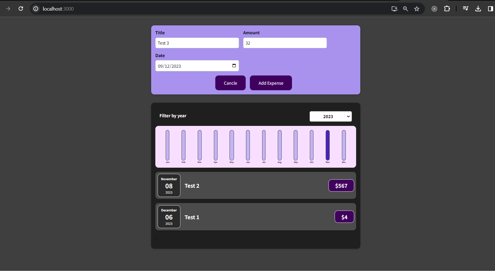

Developed using React, this application serves as an expense tracking tool, allowing users to input expenses, filter them by year, and visualize data through charts. The application consists of various parts, including rendering individual expenses, managing expense data and filtering, visualizing expense data, selecting filter options, and formatting dates.

Domain: https://react-project-five-cyan.vercel.app/

