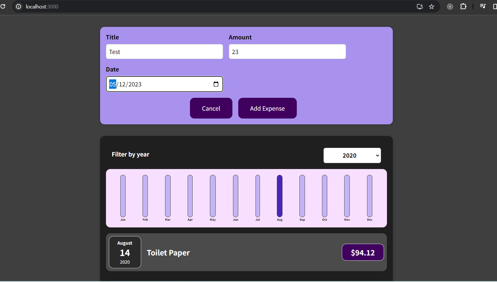

Developed using React, this application consists of various parts, including rendering individual expenses, managing expense data and filtering, visualizing expense data, selecting filter options, and formatting dates. Multiple components are designed to organize the application, allowing for easy data exchange between different parts of the program using props.

The useState hook is utilized to manage the selected filter year state. Dates are formatted into month, day, and year utilizing JavaScript Date methods.

Domain: https://react-project-five-cyan.vercel.app/

